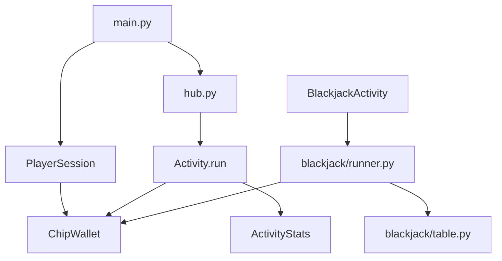

# Architecture

## Package overview

```
degen-llms/
├── mandalay_bay/          # Casino hub & economy
│   ├── main.py            # CLI entry, session bootstrap
│   ├── hub.py             # Lobby navigation
│   ├── chips.py           # ChipWallet & ledger
│   ├── session.py         # PlayerSession & stats
│   ├── hotel.py           # Hotel state, hallway, checkout lifecycle
│   ├── hotel_experience.py
│   ├── room_amenities.py  # In-room TV, minibar, phone, events
│   ├── pool_complex.py    # 11-acre pool zones & events
│   ├── resort_bridge.py   # Cross-system event requirements
│   ├── resort_completion.py
│   ├── casino_amenities.py
│   ├── rewards.py / rewards_perks.py
│   └── activities/
│       ├── base.py        # Activity ABC
│       ├── registry.py    # Activity catalog
│       ├── blackjack.py   # Table game wrapper
│       ├── slots.py       # Slot machines
│       └── sportsbook.py  # Sports wagering
├── blackjack/             # Blackjack engine
│   ├── table.py           # Round orchestration
│   ├── cards.py           # Shoe & dealing
│   ├── rules.py           # Action legality
│   ├── runner.py          # Casino wallet integration
│   └── ...
├── docs/                  # Documentation & web terminal (GitHub Pages)
│   ├── js/
│   │   ├── hotel.js / hotel-ui.js
│   │   ├── room-amenities.js
│   │   ├── pool-complex.js
│   │   ├── resort-bridge.js / resort-completion.js
│   │   └── casino-amenities.js
│   └── rpg/               # Phaser overworld (main_resort, hotel_tower, mandalay_beach)
└── tests/                 # pytest suite
```

## Data flow



## Key abstractions

### ChipWallet (`mandalay_bay/chips.py`)

Single source of truth for chip balance. Methods:

- `debit()` / `credit()` — immediate wager/payout
- `apply_delta()` — net change with ledger entry
- `reconcile()` — align with external balance (blackjack rail)
- `buy_in()` / `cash_out()` — Cashier operations

### PlayerSession (`mandalay_bay/session.py`)

Per-visit state: player name, wallet, display prefs, activity statistics.

### Activity (`mandalay_bay/activities/base.py`)

```python
class Activity(ABC):
    info: ActivityInfo  # id, name, floor, description, min_bet

    def run(self, session: PlayerSession, ui: TerminalUI) -> None: ...
    def can_enter(self, session: PlayerSession) -> bool: ...
```

Activities are registered in `activities/registry.py` and discovered by floor.

### TerminalUI (`mandalay_bay/display.py`)

Shared terminal rendering: banners, menus, prompts, chip formatting, color control.

## Activity registry

```python
ALL_ACTIVITIES = [
    BlackjackActivity(),
    SlotsActivity(),
    SportsbookActivity(),
]
```

Floors are defined by `ActivityInfo.floor`:

- Table Games
- Slot Machines
- Sports Book

## RNG layer

All games import from `blackjack/rng.py`:

- `SECURE_RANDOM` — `secrets.SystemRandom()` singleton
- `fisher_yates_shuffle()` — in-place shuffle for shoes

Slots and sports book use `SECURE_RANDOM` directly for outcome generation.

## Blackjack integration

The blackjack engine is decoupled from the casino:

| Mode | Entry | Wallet |
|------|-------|--------|
| Standalone | `blackjack/main.py` | Internal player bankroll |
| Casino | `blackjack/runner.py` | Synced via `ChipWallet` |

`run_casino_blackjack()` sets the human player's rail to wallet balance, applies `apply_delta()` after each hand, and `reconcile()` on exit.

## Extension points

See [Adding Activities](adding-activities.md) for plugging in new games.

## Testing

- Unit tests per module in `tests/`
- Integration tests for navigation in `tests/test_casino_navigation.py`
- Injectable deterministic RNG for blackjack tests only
