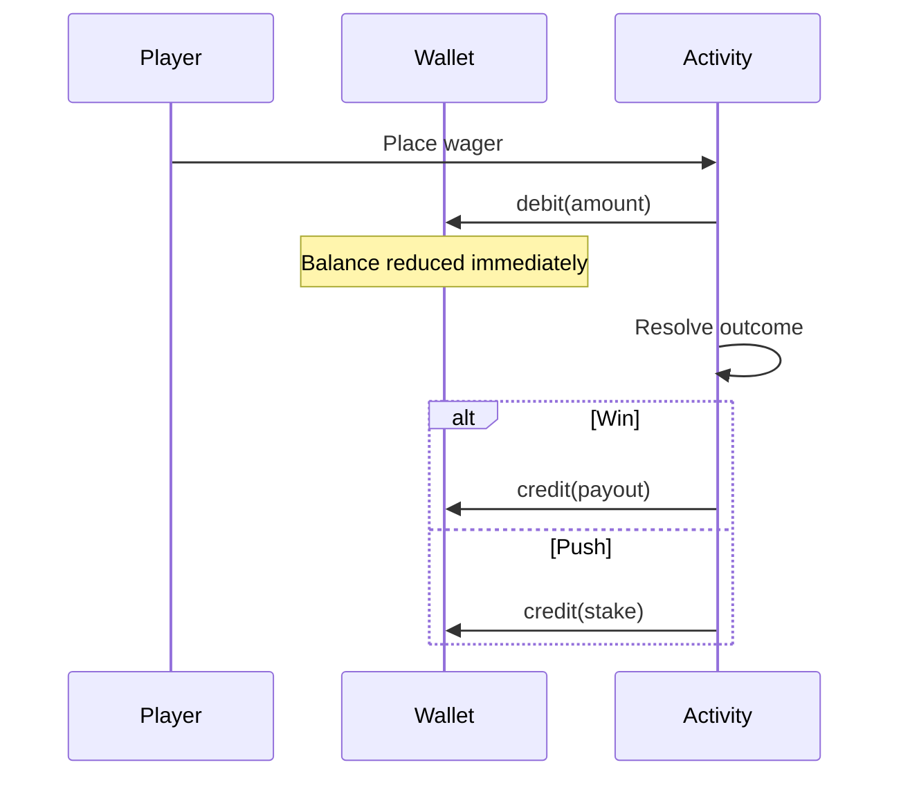

# Chip Economy

The Mandalay Bay uses a **unified chip wallet** shared across every activity.

## Core concepts

| Concept | Description |
|---------|-------------|
| **Chip** | Single currency unit ($1 = 1 chip) |
| **Wallet** | Your balance everywhere on the floor |
| **Ledger** | Audit trail of every transaction |
| **Buy-in** | Purchase chips at the Cashier (not gambling) |
| **Cash-out** | Remove chips from your wallet at the Cashier |

## How wagers work



### By activity

| Activity | When chips move |
|----------|-----------------|
| **Blackjack** | Bet deducted at hand start; settlement applied after each hand; wallet synced to table rail |
| **Slots** | Debited per spin; wins credited immediately |
| **Sports Book** | Debited when ticket placed; credited on settlement (or push refund) |
| **Cashier** | Buy-in credits; cash-out debits |

## Transaction ledger

Every operation creates a ledger entry:

```
14:32:01 | blackjack    | -50  | bal 950  | Hand result
14:32:45 | blackjack    | +100 | bal 1050 | Hand result
14:35:10 | slots        | -25  | bal 1025 | Slot spin $25
14:35:10 | slots        | +50  | bal 1075 | Two cherries! 2x
14:40:00 | cashier      | +500 | bal 1575 | Purchased $500 in chips
```

View the last 20 entries at **Cashier → View transaction ledger**.

## Transaction types

| Type | Meaning |
|------|---------|
| `buy_in` | Cashier purchase |
| `cash_out` | Cashier withdrawal |
| `wager` | Bet placed or net loss recorded |
| `win` | Payout credited |

## Player Stats vs ledger

- **Player Stats** — aggregated net per activity (visits, bets, net winnings)
- **Session net** — sum of all gambling transactions (excludes buy-ins and cash-outs)
- **Ledger** — line-by-line audit trail

## Blackjack wallet sync

Blackjack maintains a **table rail** (in-hand balance) that mirrors your wallet:

1. On sit-down: rail = wallet balance
2. After each hand: wallet adjusted by net hand result
3. On stand-up: final reconciliation ensures wallet = rail

This prevents desync between the table and the casino floor.

## Insufficient funds

Activities check balance before accepting wagers:

- Cannot spin slots below machine minimum
- Cannot sit at blackjack below table minimum
- Cannot place sports wagers below $10 or above balance
- Cashier cash-out disabled at $0 balance

Visit the **Cashier** to buy more chips when low.
