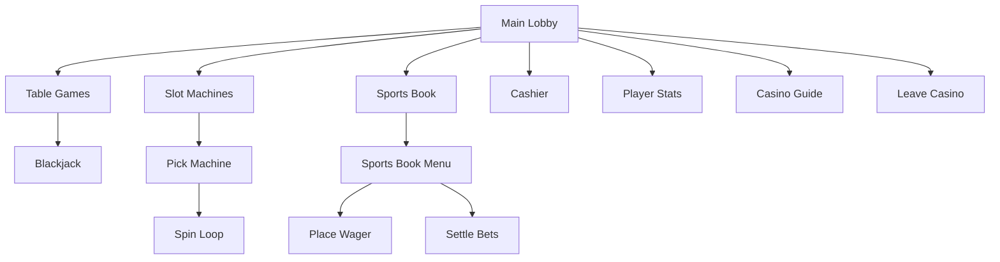

# Player Guide

This guide documents every screen, menu, and dialog in **The Mandalay Bay** digital casino.

## Navigation model

The casino uses a **hub-and-spoke** pattern:



- **Main lobby** has no "Back" option — you are always at the root
- **Sub-menus** show `0) Back` to return to the previous screen
- **Chip balance** is displayed on every major screen

## Main lobby

```
══════════════════════════════════
  The Mandalay Bay
══════════════════════════════════
Welcome, Guest
Chips: $1,000

Choose your adventure:
  1) Explore Table Games
  2) Explore Slot Machines
  3) Explore Sports Book
  4) Cashier
  5) Player Stats
  6) Save Game
  7) Casino Guide
  8) Leave Casino
```

| Option | Action |
|--------|--------|
| 1–3 | Enter a casino floor and pick an activity |
| 4 | Buy/cash out chips, view ledger |
| 5 | Session statistics per activity |
| 6 | Manual save to your slot |
| 7 | In-game rules and controls reference |
| 8 | Auto-save and exit (confirmation required) |

Progress **auto-saves** after each floor activity and when leaving.

### Low balance notice

If your balance drops below **$50**, a warning appears suggesting a Cashier visit.

---

## Save library (entry screen)

Before the casino floor, you manage save slots:

```
Save options:
  1) Load a save slot
  2) Create new save in empty slot
  3) Delete a save slot
  4) Refresh library
  5) Exit without playing
```

Most recently played saves appear first. Up to **5 slots** total.

See [Save Slots](saves.md) for CLI usage (`--slot`, `--new`, `--list-saves`).

---

## Welcome screen

Shown once on launch (skip with `--no-intro`):

- Casino name and tagline
- Your player name and starting chips
- Tip about the Casino Guide

Press **Enter** to enter the lobby.

---

## Table Games floor

```
Table Games:
  1) Blackjack — Classic 21 with solo or full-table play... (min 10 chips)
  0) Back
```

### Blackjack table menu

```
Choose your table:
  1) Quick hand (solo, table minimums)
  2) Custom table setup
  0) Back
```

**Quick hand** — Solo vs dealer, $10–$100 bets (capped by balance), 6 decks, H17.

**Custom table setup** walks through:

| Step | Options |
|------|---------|
| Table mode | Solo vs dealer / Full table with AI players |
| Minimum bet | $1 – your balance |
| Maximum bet | min bet – your balance |
| Decks | 1–8 |
| Simulated players | 1–6 (table mode only) |
| Your seat | 1 to (bots + 1) |
| Dealer rule | H17 or S17 |

### At the blackjack table

| Prompt | Input |
|--------|-------|
| Place bet | Dollar amount; `q`/`quit`/`leave` to exit |
| Your turn | `h` hit, `s` stand, `d` double, `p` split, `u` surrender |
| Insurance | `y` / `n` |
| Another hand | `y` / `n` |

When you leave, chips sync to your casino wallet and a session net is shown.

---

## Slot Machines floor

```
Slot Machines:
  1) Mandalay Bay Slots — Full floor lineup (min 1 chip)
  0) Back
```

### Machine selection

Choose a **stake tier** first, then pick from fourteen machines modeled after the Mandalay Bay casino floor:

| Stake tier | Range |
|------------|-------|
| Penny & Low Limit | $1 – $25 |
| Standard | $5 – $100 |
| High Limit | $25 – $500 |
| **401K Contribution** | **$542 – $6,500** |
| **High Roller / No Limit** | **$2,500 – bankroll (no cap)** |

| Machine | Base bet range | Notes |
|---------|-----------|-------|
| Mandalay Fortune | $5 – $50 | Classic three-reel |
| High Roller | $25 – $500 | High-limit room |
| **Megabucks** | $1 – $3 | Wide-area progressive |
| Wheel of Fortune | $1 – $25 | Bonus wheel theme |
| Blazin' 7s | $1 – $25 | Flaming sevens |
| Buffalo Gold | $1 – $50 | Stampede theme |
| Monte Carlo | $1 – $5 | Linked progressive |
| Super Spin | $1 – $5 | Linked progressive |
| Triple Red Hot 7s | $1 – $25 | Red-hot triple 7s |
| Double Jackpot | $1 – $25 | Two-tier jackpots |
| Spooky Link | $1 – $25 | Mo Mummy / Yo Yeti theme |
| Wizard of Oz | $1 – $25 | Hold & Spin theme |
| Emerald Guardian | $1 – $25 | Dragon guardian theme |
| Tiger and Dragon | $1 – $50 | Super bonus theme |

Progressive jackpots (Megabucks, Monte Carlo, Super Spin) grow with every spin and persist in your save. **Max bet is required** to qualify for the jackpot on progressive machines.

If your balance is below a machine's minimum, you cannot play that machine.

### Spin loop

```
Chips: $950
Spin amount (5-50, 0 to leave) [5]: 25

  [ 🍒 | 7 | 🍋 ]

No win this spin.
Spin again? (Y/n):
```

| Input | Result |
|-------|--------|
| Bet amount | Spin the reels |
| `0` | Leave the machine |
| `n` at "Spin again?" | End session |

---

## Sports Book floor

```
--- Today's Board ---
  1) [NFL] Chiefs @ Raiders
     ML: Chiefs +130 | Raiders -150
     Spread: Raiders -1.5 (-110) | Chiefs +1.5 (-110)
  ...

Sports Book:
  1) Place a wager (2 open ticket(s))
  2) Settle all open bets (2 ticket(s))
  3) Refresh lines
  0) Back
```

### Placing a wager

1. **Event number** — pick from the board
2. **Bet type** — Moneyline or Spread
3. **Pick** — Team or spread side
4. **Wager amount** — min $10 up to your balance

Chips are debited immediately when the ticket is placed.

### Settling bets

Select **Settle all open bets** to simulate final scores and resolve all pending tickets. Wins credit your wallet; losses are already debited.

### Refresh lines

Generates a new board of four events with updated odds.

---

## Cashier

```
Chip window:
  1) Buy chips ($500 bundle)
  2) Buy custom amount
  3) Cash out chips
  4) View transaction ledger
  0) Back
```

| Option | Behavior |
|--------|----------|
| $500 bundle | Instant $500 buy-in |
| Custom amount | $50 – $100,000 |
| Cash out | $1 – current balance (disabled at $0) |
| Ledger | Last 20 transactions with timestamps |

---

## Player Stats

Displays:

- Player name and current balance
- Session net (gambling only, excludes buy-ins)
- Per-activity: visits, total bets, net winnings

---

## Casino Guide

In-game help with six sections:

1. Overview & navigation
2. Blackjack rules & controls
3. Slot machine paytable
4. Sports book guide
5. Chip economy
6. View all sections

---

## Mandalay Bay Hotel Experience

Exit the casino floor to the **hotel lobby** (web: hub menu or RPG HUD link; deep link: `?view=hotel-lobby`).

### Hotel flow

1. **MGM Rewards (P)** → Reservation — locate your tower and floor
2. **Hallway mini-game** — three beats of directional choices (wrong turns are comedic)
3. **Your room** — TV, minibar, phone, decisions, unlockable Vegas vignettes

### In-room amenities

| Amenity | Highlights |
|---------|------------|
| TV | Shark Reef (ch. 47), wave pool cam, ULTRA Arena boxing, House of Blues (Gold+) |
| Minibar | Sensor-enabled charges; concierge suggests items |
| Phone | Concierge, bookie, Foundation Room (Noir+ penthouse), spa, Delano |
| Decisions | Balcony, sky bridge to Mandalay Place, suite/penthouse perks, wake-up roulette |

**17 unlockable room events** chain across pool visits, shopping (LUSH bath bomb), tier status, and bad decisions. Locked events show cryptic hints in the event log.

### World day/night cycle

**2 hours real time = 1 resort day.** The hub and hotel lobby show the current phase and time until the next day.

Each new day:
- **Daily charges** post automatically (room rate + resort fee + parking — higher for suites/penthouse)
- **Reservation requirement rotates:** phone only → desk only → phone + desk → net-positive whale check-in
- **Insufficient chips** locks room access until you settle overdue charges at the front desk or win on the casino floor

Platinum+ tiers reduce resort fees; Chairman tier waives them narratively.

### Stay lifecycle (Front Desk)

- **Review folio** — minibar + room service + Mandalay Place deliveries
- **Late checkout** — comp if net-positive, else $75
- **Express checkout** — Pearl+ skips the line; Chairman waives the folio narratively
- **Standard checkout** — decrements nights; at 0 nights Carmen offers extend-stay

### Resort completion tracker

The hotel lobby and in-room hub show progress: room vignettes, pool vignettes, TV channels sampled, guest book signed. Unlock all room events to auto-sign the guest directory.

### RPG maps (Phase 3)

From the casino lobby overworld:
- **East lobby tile** → Hotel Tower (Clerk Carmen, room door)
- **West lobby tile** → Mandalay Beach pool map (wave pool, shark reef, beach rave NPCs sync pool-complex saves)

---

## Global shortcuts & tips

| Context | Shortcut |
|---------|----------|
| Sub-menus | `0` — go back |
| Blackjack bet | `q`, `quit`, `leave` — leave table |
| Yes/no prompts | Enter = default; `y`/`n` |
| Interrupt | `Ctrl+C` — exit with balance shown |

## Keyboard efficiency

All menus accept numeric choices. Defaults are shown in `[brackets]` — press Enter to accept.
