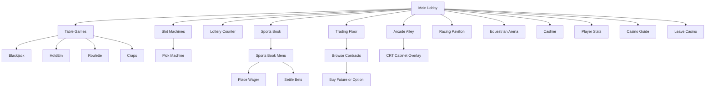

# Player Guide

This guide documents every screen, menu, and dialog in **The Mandalay Bay** digital resort simulator.

## Navigation model

The casino uses a **hub-and-spoke** pattern:


```mermaid
flowchart TD
    lobby[Main Lobby]
    lobby --> tableGames[Table Games]
    lobby --> slots[Slot Machines]
    lobby --> lottery[Lottery Counter]
    lobby --> sports[Sports Book]
    lobby --> trading[Trading Floor]
    lobby --> arcade[Arcade Alley]
    lobby --> racing[Racing Pavilion]
    lobby --> equestrian[Equestrian Arena]
    lobby --> cashier[Cashier]
    lobby --> stats[Player Stats]
    lobby --> guide[Casino Guide]
    lobby --> exit[Leave Casino]

    tableGames --> blackjack[Blackjack]
    tableGames --> holdem[HoldEm]
    tableGames --> roulette[Roulette]
    tableGames --> craps[Craps]
    slots --> machinePick[Pick Machine]
    sports --> bookMenu[Sports Book Menu]
    bookMenu --> wager[Place Wager]
    bookMenu --> settle[Settle Bets]
    trading --> markets[Browse Contracts]
    markets --> buy[Buy Future or Option]
    arcade --> cabinet[CRT Cabinet Overlay]
```

- **Main lobby** has no "Back" option — you are always at the root
- **Sub-menus** show `0) Back` to return to the previous screen
- **Chip balance** is displayed on every major screen

## Main lobby

```
══════════════════════════════════
  The Mandalay Bay
══════════════════════════════════
Welcome, Guest
Chips: $1,000

Choose your adventure:
  1) Explore Table Games
  2) Explore Slot Machines
  3) Explore Lottery Counter
  4) Explore Sports Book
  5) Explore Trading Floor
  6) Explore Arcade Alley
  7) Explore Racing Pavilion
  8) Explore Equestrian Arena
  9) Cashier
 10) Player Stats
 11) Save Game
 12) Casino Guide
 13) Leave Casino
```

| Option | Action |
|--------|--------|
| 1–8 | Enter a casino floor and pick an activity |
| 9 | Buy/cash out chips, view ledger |
| 10 | Session statistics per activity |
| 11 | Manual save to your slot |
| 12 | In-game rules and controls reference |
| 13 | Auto-save and exit (confirmation required) |

Progress **auto-saves** after each floor activity and when leaving.

### Low balance notice

If your balance drops below **$50**, a warning appears suggesting a Cashier visit.

---

## Cabinet title scene (web)

The browser terminal opens on a **digital table-game cabinet** attract screen — felt oval, chrome bezel, LED marquee, and a “Press Start” prompt — in the same spirit as the pixel RPG loading intro. It advances automatically after a few seconds, or immediately on **Enter** / click / tap.

Skip it with `?skipIntro=1` (or `?skipTitle=1`). Deep links (`?guest=1`, `?slot=N`) also skip straight into play.

---

## Save library (entry screen)

Before the casino floor, you manage save slots:

```
Save options:
  1) Load a save slot
  2) Create new save in empty slot
  3) Delete a save slot
  4) Refresh library
  5) Exit without playing
```

Most recently played saves appear first. Up to **5 slots** total.

See [Save Slots](saves.md) for CLI usage (`--slot`, `--new`, `--list-saves`).

---

## Welcome screen

Shown once on launch (skip with `--no-intro`):

- Casino name and tagline
- Your player name and starting chips
- Tip about the Casino Guide

Press **Enter** to enter the lobby.

---

## Table Games floor

Activities: Blackjack, Texas Hold'em, Mandalay Roulette, Craps (min 10 chips). See [Table Games](table-games.md) for Hold'em, roulette, and craps.

```
Table Games:
  1) Blackjack — Classic 21 with solo or full-table play... (min 10 chips)
  2) Texas Hold'em — No-limit 5-player table
  3) Mandalay Roulette — American wheel (0/00)
  4) Craps — Pass Line, Don't Pass, side bets
  0) Back
```

### Blackjack table menu

```
Choose your table:
  1) Quick hand (solo, table minimums)
  2) Custom table setup
  0) Back
```

**Quick hand** — Solo vs dealer, $10–$100 bets (capped by balance), 6 decks, H17.

**Custom table setup** walks through:

| Step | Options |
|------|---------|
| Table mode | Solo vs dealer / Full table with AI players |
| Minimum bet | $1 – your balance |
| Maximum bet | min bet – your balance |
| Decks | 1–8 |
| Simulated players | 1–6 (table mode only) |
| Your seat | 1 to (bots + 1) |
| Dealer rule | H17 or S17 |

### At the blackjack table

| Prompt | Input |
|--------|-------|
| Place bet | Dollar amount; `q`/`quit`/`leave` to exit |
| Your turn | `h` hit, `s` stand, `d` double, `p` split, `u` surrender |
| Insurance | `y` / `n` |
| Another hand | `y` / `n` |

When you leave, chips sync to your casino wallet and a session net is shown.

---

## Slot Machines floor

```
Slot Machines:
  1) Mandalay Bay Slots — Full floor lineup (min 1 chip)
  0) Back
```

### Machine selection

Choose a **stake tier** first, then pick from fourteen machines modeled after the Mandalay Bay casino floor:

| Stake tier | Range |
|------------|-------|
| Penny & Low Limit | $1 – $25 |
| Standard | $5 – $100 |
| High Limit | $25 – $500 |
| **401K Contribution** | **$542 – $6,500** |
| **High Roller / No Limit** | **$2,500 – bankroll (no cap)** |

| Machine | Base bet range | Notes |
|---------|-----------|-------|
| Mandalay Fortune | $5 – $50 | Classic three-reel |
| High Roller | $25 – $500 | High-limit room |
| **Megabucks** | $1 – $3 | Wide-area progressive |
| Wheel of Fortune | $1 – $25 | Bonus wheel theme |
| Blazin' 7s | $1 – $25 | Flaming sevens |
| Buffalo Gold | $1 – $50 | Stampede theme |
| Monte Carlo | $1 – $5 | Linked progressive |
| Super Spin | $1 – $5 | Linked progressive |
| Triple Red Hot 7s | $1 – $25 | Red-hot triple 7s |
| Double Jackpot | $1 – $25 | Two-tier jackpots |
| Spooky Link | $1 – $25 | Mo Mummy / Yo Yeti theme |
| Wizard of Oz | $1 – $25 | Hold & Spin theme |
| Emerald Guardian | $1 – $25 | Dragon guardian theme |
| Tiger and Dragon | $1 – $50 | Super bonus theme |

Progressive jackpots (Megabucks, Monte Carlo, Super Spin) grow with every spin and persist in your save. **Max bet is required** to qualify for the jackpot on progressive machines.

If your balance is below a machine's minimum, you cannot play that machine.

### Spin loop

```
Chips: $950
Spin amount (5-50, 0 to leave) [5]: 25

  [ 🍒 | 7 | 🍋 ]

No win this spin.
Spin again? (Y/n):
```

| Input | Result |
|-------|--------|
| Bet amount | Spin the reels |
| `0` | Leave the machine |
| `n` at "Spin again?" | End session |

---

## Lottery Counter

Pick 3, Pick 4, Mega draw, and scratchers. Quick pick or enter your own numbers. See [Lottery Counter](lottery.md).

---

## Sports Book floor

Two tabs: **Sports** (moneyline, spread, totals, props, futures, parlays) and **Predictions** (binary contracts). Boards page through stored scenario DBs. See [Sports Book](sportsbook.md).

```
--- Today's Board ---
  1) [NFL] Chiefs @ Raiders
     ML: Chiefs +130 | Raiders -150
     Spread: Raiders -1.5 (-110) | Chiefs +1.5 (-110)
  ...

Sports Book:
  1) Place sports wager
  2) Build parlay (2–4 legs)
  3) Settle all open positions
  4) Next scenario slate
  0) Back
```

### Placing a wager

1. **Event number** — pick from the board
2. **Bet type** — Moneyline, Spread, Total, Prop, Outright, or Futures (gated by event)
3. **Pick** — Team, side, or field member
4. **Wager amount** — min $10 up to your balance

Chips are debited immediately when the ticket is placed.

### Settling bets

Select **Settle all open bets** to simulate final scores and resolve all pending tickets. Wins credit your wallet; losses are already debited.

### Refresh lines

Generates a new board of events with updated odds.

---

## Trading Floor

Browse the stored contract catalog, filter by asset class / instrument, buy futures or options, then settle. See [Trading Floor](trading-floor.md).

---

## Arcade Alley

Pick a cabinet card to open the **CRT overlay** — Strip Cross, Neon Invaders, High-Roller Breakout, or Showgirl Beat. Earn tickets and redeem small perks. See [Arcade Alley](arcade.md).

---

## Racing Pavilion & Equestrian Arena

Thoroughbred win/place/show wagering (min 5 chips) and equestrian dressage / show jumping (min 10 chips). See [Racing and Equestrian](racing.md).

---

## Cashier

```
Chip window:
  1) Buy chips ($500 bundle)
  2) Buy custom amount
  3) Cash out chips
  4) View transaction ledger
  0) Back
```

| Option | Behavior |
|--------|----------|
| $500 bundle | Instant $500 buy-in |
| Custom amount | $50 – $100,000 |
| Cash out | $1 – current balance (disabled at $0) |
| Ledger | Last 20 transactions with timestamps |

---

## Player Stats

Displays:

- Player name and current balance
- Session net (gambling only, excludes buy-ins)
- Per-activity: visits, total bets, net winnings

---

## Casino Guide

In-game help with sections for every activity:

1. Overview & navigation
2. Blackjack rules & controls
3. Hold'em, roulette, craps
4. Slot machine paytables
5. Lottery tickets
6. Sports book & prediction markets
7. Trading Floor
8. Racing & equestrian
9. Chip economy

---

## Mandalay Bay Hotel Experience

Exit the casino floor to the **hotel lobby** (web: hub menu or RPG HUD link; deep link: `?view=hotel-lobby`).

### Hotel flow

1. **MGM Rewards (P)** → Reservation — locate your tower and floor
2. **Front desk** — confirm at the desk on the days that require it; your key activates the moment the day's requirement is met, from either the phone or the desk
3. **Hallway mini-game** — three beats of directional choices (wrong turns are comedic)
4. **Your room** — TV, minibar, phone, decisions, unlockable Vegas vignettes

### In-room amenities

| Amenity | Highlights |
|---------|------------|
| TV | Shark Reef (ch. 47), wave pool cam, ULTRA Arena boxing, House of Blues (Gold+) |
| Minibar | Sensor-enabled charges; concierge suggests items |
| Phone | Concierge, bookie, Foundation Room (Noir+ penthouse), spa, Delano |
| Decisions | Balcony, sky bridge to Mandalay Place, suite/penthouse perks, wake-up roulette |

**17 unlockable room events** chain across pool visits, shopping (LUSH bath bomb), tier status, and bad decisions. Locked events show cryptic hints in the event log.

### World day/night cycle

**2 hours real time = 1 resort day.** The hub and hotel lobby show the current phase and time until the next day.

Each new day:
- **Daily charges** post automatically (room rate + resort fee + parking — higher for suites/penthouse)
- **Reservation requirement rotates:** phone only → desk only → phone + desk → net-positive whale check-in
- **Insufficient chips** locks room access until you settle overdue charges at the front desk or win on the casino floor

Platinum+ tiers reduce resort fees; Chairman tier waives them narratively.

### Stay lifecycle (Front Desk)

- **Review folio** — minibar + room service + Mandalay Place deliveries
- **Late checkout** — comp if net-positive, else $75
- **Express checkout** — Pearl+ skips the line; Chairman waives the folio narratively
- **Standard checkout** — decrements nights; at 0 nights Carmen offers extend-stay

### Resort completion tracker

The hotel lobby and in-room hub show progress: room vignettes, pool vignettes, TV channels sampled, guest book signed. Unlock all room events to auto-sign the guest directory.

## The pixel RPG

Open `/rpg/index.html`, pick a guest type, and set your skin tone, hair, and
outfit — the preview is the sprite you'll actually walk around as, and you can
change it later from the Trainer Card's wardrobe. You arrive on Las Vegas Blvd
and walk in through the gold doors. Everything below runs on the same wallet,
the same save slot, and the same rules as the terminal — the RPG mounts the
terminal's own screens rather than reimplementing them.

### Controls

| Input | Action |
|-------|--------|
| WASD / arrows | Walk |
| Tap / click a tile | Walk there — the whole game is playable on a phone |
| Shift | Run — faster once a host comps you the golf cart at Platinum |
| E / Enter / Space | Talk to whoever you are facing, advance dialogue |
| Esc / X | START menu |
| T | Trainer Card and wardrobe |
| P | MGM Rewards phone |

On a phone the game fills the screen and a thumb pad appears in the bottom
corners: a d-pad on the left, **B** to run, **A** to talk, and **☰** for the
START menu. You can ignore the pad entirely and just tap — tap a tile to walk
there, tap somebody to walk over and talk to them, and tap anywhere on the
screen to advance dialogue. The pad gets out of the way whenever a conversation
or a panel is on screen.

Gold walkways are the resort's wayfinding: follow them and they connect the
entrance, the pits, the aisles, and every door. Dark trim marks where one floor
ends and the next begins, and floating signs name the zone you're standing in.

### Getting around

Thirty-two rooms across the Strip, Arrival, Casino, Retail, Bars, Hotel, Pool,
Attractions, and back-of-house wings. Doors sit on the outer walkable ring of each
room — walk onto one and you warp, with a placard naming where you landed.

| Wing | What's there |
|------|--------------|
| Arrival | The Boulevard, valet garage (Strip Drive cabinet + exits east/south), registration lobby (Chip Chandler starts you off) |
| Casino | Two casino floors, the race & sports book, High Limit Salon, Foundation Room |
| Retail | The Shoppes at Mandalay Place, the sky bridge, the convention center |
| Bars | Betty's Bar and the Skyfall Lounge |
| Hotel | Tower elevators, guest corridor, your room, the Delano wing, the bathhouse |
| Pool | Mandalay Beach wave pool, cabana row, the beach club, the moonlight rave |
| Attractions | Shark Reef tunnel and exhibit, House of Blues (+ green room), ULTRA Arena |
| Back of house | The staff corridor, if you can find the way in |

Two doors are gated: the High Limit Salon checks chips and stake tier at the
rope, and the Foundation Room wants Noir standing. Your own room door stops
working if the folio goes unpaid.

### The START menu

Trainer Card, Quests, Dex, Bag, Secrets, Rewards Phone, Off-Strip Bank, Player
Stats, Staff Manifest, Guest Book, Resort Completion, Options, Save, and Exit
to Terminal. The Quests page lists what you have accepted *and* what you have
not, with the name of the person who hands each one out.

### Trainers

Some staff will spot you from across the room, walk over, and put you on the
spot: Slot Tech Tessa, Bookie Blake, Spinster Sal, Lifeguard Lou, the Moonlight
DJ, Busker Bo, Housekeeper Hana, Valet Vic, Whale Warren, and the salon dealer.
Each one challenges you once.

### Collections

- **Dex** — five Shark Reef species, fourteen slot machines, and every dealer
  and staff member you meet.
- **Bag** — quest rewards, mall purchases, and whatever the minibar sensors
  caught you taking.
- **Secrets** — twelve easter eggs. All cosmetic; none of them pay chips.

### The clock

Two real hours are one resort day, in four phases. When the day turns, resort
charges post to your wallet, the reservation requirement rotates, and if you
cannot cover the bill your key stops working until you settle at the desk or
win it back on the floor. The HUD shows the day, the time, and the phase.

---

## Global shortcuts & tips

| Context | Shortcut |
|---------|----------|
| Sub-menus | `0` — go back |
| Blackjack bet | `q`, `quit`, `leave` — leave table |
| Yes/no prompts | Enter = default; `y`/`n` |
| Interrupt | `Ctrl+C` — exit with balance shown |

## Keyboard efficiency

All menus accept numeric choices. Defaults are shown in `[brackets]` — press Enter to accept.
