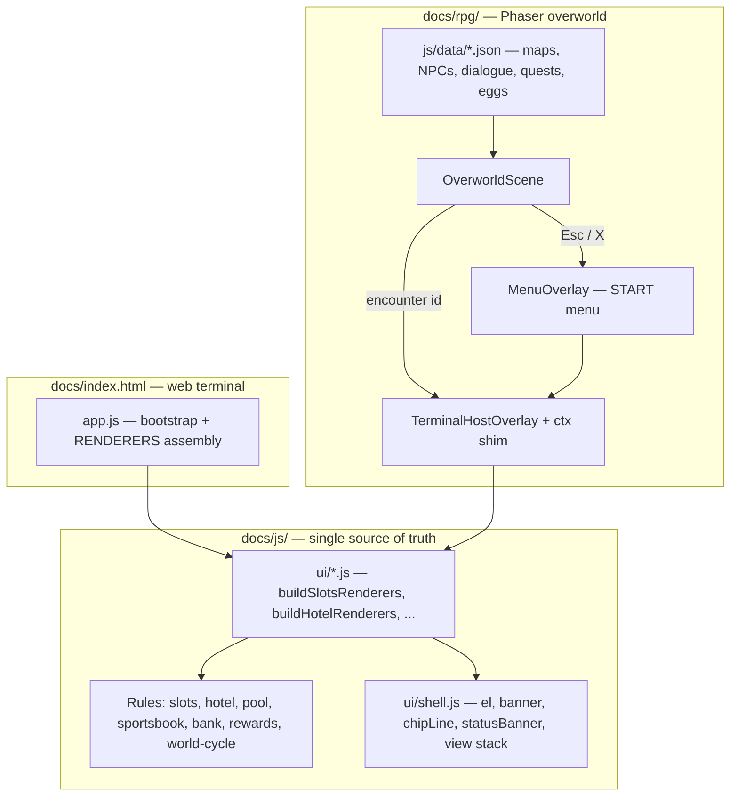

# The Mandalay Bay — Pixel RPG Game Design Document

**Status:** Phases 1–6 complete
**Audience:** developers extending the Pokémon-style pixel resort
**Play URL:** `/rpg/index.html` — live at <https://exios66.github.io/degen-llms/rpg/>

---

## 1. Vision

The Mandalay Bay is a digital resort with three faces: a Python CLI, a web
terminal, and this pixel RPG. All three share one chip wallet, one save
library, and one set of game rules. The RPG's job is to make the resort a
*place* — thirty-three rooms you walk through, sixty people who have something
to say, and a clock that charges you rent whether or not you are winning.

The reference feel is Pokémon: a top-down overworld, a START menu that holds
your whole life, trainers who spot you from across the room, a collection dex,
and secrets that pay in flavor rather than money.

### The delegation rule

**The RPG does not reimplement game logic or game screens.** Every casino,
hotel, pool, and shopping flow lives once in `docs/js/` and is *mounted* by the
RPG inside an encounter panel. When the terminal gains a feature, the RPG gets
it for free.

The only screens the RPG draws itself are the ones that read better in-world:
blackjack, hold'em, roulette, and the House of Blues rhythm minigame. Those are
the battle screens.

---

## 2. Architecture



### Where things live

| Concern | File |
|---------|------|
| Boot, save picker, HUD wiring | `js/main.js`, `js/scenes/TitleScreen.js` |
| Overworld scene, movement, triggers | `js/scenes/GameScenes.js` |
| Tap-to-walk routing | `js/systems/Pathfinder.js` |
| On-screen D-pad and buttons | `js/systems/TouchControls.js` |
| Wardrobe ramps and NPC looks | `js/systems/CharacterAppearance.js`, `js/systems/CharacterCreator.js` |
| Tile vocabulary | `js/systems/MapTiles.js` |
| JSON → tile layers | `js/systems/MapLoader.js` |
| Map/NPC/door accessors + procedural fallback | `js/systems/MapData.js` |
| Procedural sprites and tiles (16px art grids) | `js/systems/TextureFactory.js` |
| Vendored tiles + procedural FX | `js/systems/EnvironmentTextures.js` |
| Character / staff sprite sheets | `js/systems/CharacterSprites.js` |
| Dialogue graph | `js/systems/DialogueManager.js` |
| Encounter routing | `js/systems/EncounterBridge.js`, `js/systems/HostedEncounters.js` |
| Mounting terminal screens | `js/systems/TerminalHostOverlay.js` |
| START menu | `js/systems/MenuOverlay.js` |
| Quests, dex, bag, secrets | `js/systems/QuestManager.js`, `Dex.js`, `Inventory.js`, `EasterEggs.js` |
| Save bridge | `js/systems/SaveAdapter.js`, `docs/js/core.js` |
| Procedural audio | `js/systems/AudioManager.js` |

### Movement and input

The keyboard drives an eight-way velocity that is normalised on the diagonal, so
walking north-east is not forty percent faster than walking north. A tap or a
click is the same gesture on a phone and a desktop: `Pathfinder.findPath()`
breadth-firsts across the same collision grid the physics body collides with,
`nearestReachable()` re-targets a tap that landed on a wall or an NPC to the
closest tile beside it, and `smoothPath()` drops every waypoint that can be
skipped in a straight line — otherwise a route across an open floor comes back
as a staircase and is walked as a series of one-tile hops.

Two smaller rules keep the walk from feeling sticky. A waypoint counts as
reached within a radius that scales with the current speed, rather than at an
exact pixel, so running does not overshoot and stutter back. And when input
pushes into a corner that is blocked on one axis only, the scene nudges along
the free axis — the Pokémon behaviour of sliding around a doorframe instead of
stopping dead against it.

`TouchControls.js` adds a D-pad and A/START buttons on coarse-pointer devices.
They feed the same input state the keyboard writes, so nothing downstream knows
which one is driving.

### Art

Everything is drawn in code against a 16-pixel grid and blitted at 2×, so a tile
is 32 screen pixels and one art pixel is always two. `TILE_SIZE` and `ART_UNIT`
in `MapTiles.js` are the only two numbers that decide this.

Tiles are procedural: a base fill, a light edge on the top and left, a dark edge
on the bottom and right, then whatever pattern the surface needs. Every surface
lights from the top left; breaking that is what makes a set of tiles look like
it came from different games. Wide floors — lobby, carpet, felt, road, sand —
also register three scuffed variants, and `groundTileKey()` spreads them across
the map so a ballroom does not read as wallpaper. `EnvironmentTextures.js` can
also map vendored PNGs under `assets/tiles/` onto the same `TILE` enum without
changing map JSON.

A pattern stamped into the middle of every tile is the failure mode to watch
for: a whole room of it reads as a chequerboard on an exact 32px grid rather
than as a surface. The carpet and the salon marble both had one and both were
rebuilt — a motif is either an outline with the field showing through, or a
quarter mark at the tile corner that four neighbours complete into one whole.
An accent that lands on one tile in five needs to be something a real floor has
that often; the boulevard's storm drain was not, and lined itself up into
diagonal rows across the road.

Characters are **not** drawn in code. `CharacterSprites.js` loads the vendored
sheets under `assets/characters/` (see its `ATTRIBUTION.md`) and repaints them:
`js/data/character-sheets.js` sorts each sheet's palette into skin / hair /
outfit / legwear ramps, and a look maps those ramps onto the ones it asks for by
relative luminance, so a recoloured guest keeps every highlight the artist drew.
`scripts/_author_sprites.py` regenerates that manifest. `CharacterAppearance.js`
owns the ramps the wardrobe offers and hashes an NPC's id into a look of its
own, so the floor is not seven faces on a loop.

Six of the world's "NPCs" are fixtures you press A on rather than guests — the
lobby lion, a room door, two kiosks, the salon cage and a minibar. `NPC_PROPS`
in `TextureFactory.js` maps them to their own art, which stands on the floor of
its tile rather than hovering in the middle of it, and their dialogue portraits
show the object instead of a stand-in face.

`scripts/smoke-test-rpg.mjs` draws every art key against a recording canvas and
fails anything that draws outside its frame, leaves a ground tile transparent,
or resolves a look to a sheet that is not on disk.

---

## 3. The world

Thirty-three rooms, each a 30×30 tile grid, authored as declarative JSON in
`js/data/maps/`. `js/data/maps/index.json` lists them; `MapLoader.compileMap()`
turns each record into ground, collision, and decor layers at boot.

| Wing | Rooms |
|------|-------|
| Arrival | Las Vegas Blvd, Valet & Parking, Mandalay Bay Tram Station, Registration Lobby |
| Casino | Casino Floor North, Casino Floor South, Race & Sports Book, High Limit Salon, Foundation Room |
| Retail | The Shoppes at Mandalay Place, Sky Bridge, Convention Center |
| Food & drink | Betty's Bar, Skyfall Lounge, Minus5 Icebar, Restaurant Row |
| Hotel | Tower Elevator Lobby, Guest Floor Corridor, Your Room, Delano Wing, Bathhouse Spa |
| Pool | Mandalay Beach, Cabanas & Hot Tubs, The Lazy River, Moorea Beach Club, Moonlight Rave Stage |
| Attractions | Shark Reef Tunnel, Shark Reef Exhibit Hall, House of Blues, HOB Green Room, Michael Jackson ONE Theatre, ULTRA Arena Concourse |
| Back of house | Back of House |

### Map record schema

```jsonc
{
  "id": "betty_bar",
  "label": "Betty's Bar",
  "bgm": "lobby",                       // AudioManager track id
  "spawn": { "x": 15, "y": 26 },        // per-map, not a global default
  "base": "WALL",                       // fill before anything else
  "rects":   [{ "tile": "CARPET", "x": 4, "y": 4, "w": 22, "h": 22 }],
  "decor":   [{ "tile": "BAR", "x": 8, "y": 8, "w": 14, "h": 1 },
              { "tile": "PLANT", "points": [[5, 5], [24, 5]] }],
  "scatter": [{ "tile": "PLANT", "mod": 11, "on": ["LOBBY"],
                "bounds": { "x": 3, "y": 21, "w": 24, "h": 5 } }],
  "clear":   [{ "tile": "CARPET", "x": 14, "y": 26, "w": 3, "h": 3 }],
  "signs":   [{ "x": 15, "y": 22, "text": "LOBBY",
                "color": "#fff8e8", "stroke": "#8a6a28" }],
  "doors":   [{ "x": 15, "y": 27, "to": "main_resort", "toX": 4, "toY": 23,
                "message": "Back to the casino floor." }]
}
```

Layers are applied in order: `base` → `rects` → `decor` → `scatter` → `clear`.
`clear` runs last so a doorway can always be punched through greenery.
`scatter` uses a deterministic hash, never a random number, so a saved position
can never end up inside new decor after an edit.

Two tiles exist purely to make a room readable at a glance. `PATH` is the gold
walkway that connects entrances, aisles, and doors, and `TRIM` is the dark
border that separates one floor type from the next — a `trim_ring()` helper in
the authoring script wraps a zone in one call. `signs` floats zone labels over
the floor in tile coordinates, fractions included, so a label can sit between
two tiles. Both are walkable; neither carries meaning beyond wayfinding.

Door options: `requiresFlag`, `requiresChips` (+ `highRollerAlt`),
`venueGate` (`high_limit_salon` | `foundation_room`, checked against
`docs/js/venues.js`), and `requiresRoomKey` (checked against
`canAccessHotelRoom()`).

### Authoring

`scripts/_author_maps.py` holds the whole world as readable Python literals and
regenerates `js/data/maps/*.json` and `js/data/npcs.json`. Edit the script, run
it, then run the integrity checker. Hand-editing the JSON works too — the
script is a convenience, not a build step.

`MapData.js` keeps the original procedural builders as a fallback: if
`MapLoader.loadWorld()` cannot fetch the JSON (file:// origin, bad deploy), the
RPG still boots into a nine-map procedural world rather than a black screen.

---

## 4. Pokémon-style systems

**START menu** (`Esc`, `X`, or `Enter` on empty ground) — Trainer Card,
Wardrobe, Stakes Desk, Resort Directory, Quests, Dex, Bag, Secrets, Rewards
Phone, Off-Strip Bank, Player Stats, Staff Manifest, Guest Book, Resort
Completion, Options, Save, Exit to Terminal. The lower half of the list mounts
shared terminal screens rather than reimplementing them.

Three of those pages exist because the overworld alone was hiding things.
**Wardrobe** re-opens the character creator mid-run and writes the result to the
save slot, so an appearance chosen once at boot is not final. **Stakes Desk**
sets the tier every table and machine preselects, which used to be reachable
only by walking up to the right dealer. **Resort Directory** lists the rooms you
have stood in with their exits, and the rooms you have only seen a door to as
leads — a wing you have not found yet stays off the list rather than padding it
with identical unknown rows.

**Line-of-sight challengers** — an NPC with `sight: { dir, range }` notices you
entering its cone, walks over, plays its `challengeDialogueId`, and drops
straight into its encounter. Each NPC challenges once, tracked by a
`challenged_<id>` flag.

**Quests** — `js/data/quests.json`. A quest is `{ label, hint, target, giver,
giverName, category, reward, rewardItem }`. Progress is *derived*, not
incremented: `QuestManager.syncDerived()` reads reef photos, bar orders, dex
counts, purchases, unlocked vignettes, egg count, and resort completion from
shared session state, so quest progress can never disagree with the systems
that produced it. Work done before a quest is accepted still counts — the
derived value is banked and applied on accept.

**Dex** — three collections in `js/systems/Dex.js`: Shark Reef species, slot
machines played, and staff met. Dealers are remapped through the staff manifest
so a renamed dealer still reads correctly.

**Bag** — story items from quests and dialogue, plus mall purchases and minibar
tabs pulled from `session.amenities`.

**Secrets** — `js/data/easter_eggs.json`, twelve entries. Discovered by dialogue
choices, zone triggers, or the Konami code. **Cosmetic only** — an egg never
pays chips. This is a hard design rule.

**Schedules** — NPCs carry a `schedule` keyed by world-cycle phase
(`dawn`/`midday`/`dusk`/`late`). They tween to their new spot when the phase
turns rather than teleporting.

---

## 5. Time and money

`docs/js/world-cycle.js` is the single clock. Two real hours are one in-game
day, split into four phases. `OverworldScene._tickWorldCycle()` runs every four
seconds and is the only thing that advances the world:

- mirrors `rpg.worldTime` for older saves and the HUD readout
- re-tints the screen when the phase turns (`PHASE_WASH`)
- walks NPCs to their scheduled positions
- announces the day and today's reservation requirement
- surfaces daily resort charges when a rollover posts
- warns when the room is evicted, and blocks the Room 24-118 door until the
  folio is settled

The RPG player therefore feels the same pressure as the terminal player: rent
is due whether or not the night went well.

---

## 6. Save format

`SAVE_VERSION` is **8** (`docs/js/core.js`). The `rpg` blob:

| Key | Meaning |
|-----|---------|
| `mapId`, `x`, `y` | position; new games start on `strip_sidewalk` |
| `archetype`, `playerSprite` | guest type and overworld sprite |
| `flags` | dialogue and world flags |
| `quests` | `{ id: { stage, target } }`, `stage: "complete"` when done |
| `inventory` | story item ids |
| `dex` | `{ reef: [], slots: [], staff: [] }` |
| `eggs` | `{ eggId: { at } }` |
| `mapVisits` | `{ mapId: count }` |
| `options` | `{ muted, textSpeed, footsteps }` |
| `reputation` | `{ whales, staff, tourists }` |
| `worldTime` | mirror of the world-cycle clock, kept for v7 readers |

`migrateRpgState()` folds a v7 save forward: existing keys are never renamed,
the new buckets are added empty, and a v7 save keeps the map it was saved on
instead of being moved to the new arrival map. The pre-Phase-1 `rpgData` blob
is folded into `rpg.flags` and no longer written.

On the Python side, `mandalay_bay/saves.py` reads `version` tolerantly and
carries `WEB_ONLY_SAVE_KEYS` (including `rpg`) through a CLI load/save round
trip untouched, so playing in the terminal never erases pixel progress.

---

## 7. Tests

| Check | Command |
|-------|---------|
| World data integrity | `node scripts/smoke-test-rpg.mjs` |
| Browser walk + e2e journey | `python3 scripts/smoke-test-web.py` |
| Screenshots for review | `python3 scripts/rpg-screenshot.py` |
| Python rules | `python3 -m pytest` |

`smoke-test-rpg.mjs` installs the authored world exactly the way `main.js` does
and then asserts referential integrity across roughly 2,200 checks: every map
compiles to a connected walkable region, every door lands somewhere you can
actually stand, every NPC is reachable in all four day phases, every
`dialogueId` / `encounter` / `giveItem` / `requiresQuestStage` resolves, every
egg flag is set by something in the world, and a v7 save migrates cleanly.

It also walks the other direction: every routable encounter must be *offered* by
an NPC or a dialogue branch. That rule is what catches the failure mode this
architecture invites — the terminal grows a screen, the RPG dutifully hosts it,
and nobody in the world ever hands it to the player. Only `stats` and
`staff_manifest` are exempt, because they are pages of the START menu.

`smoke-test-web.py` opens every terminal view, every RPG encounter, every menu
page, and then runs one continuous journey: boot a save slot, walk, get spotted
by a challenger, open the START menu, check into the hotel, reload, and confirm
position and chips came back.

---

## 8. Extending

| To add… | Do this |
|---------|---------|
| A room | Add a record to `scripts/_author_maps.py`, regenerate, add doors both ways, run the checker |
| An NPC | Add to the `NPCS` table in the same script plus a `*_greet` node in `dialogues.json` |
| A dialogue branch | Edit `js/data/dialogues.json`; gates are `requiresFlag`, `unlessFlag`, `requiresQuestStage` with `elseNext` |
| A quest | Add to `js/data/quests.json`, derive its progress in `QuestManager.syncDerived()`, and offer it from a dialogue node with `startQuest` |
| An easter egg | Add to `js/data/easter_eggs.json` and set its flag from a dialogue choice or a zone trigger. Cosmetic only |
| A casino screen | Build it in `docs/js/ui/` as `buildXRenderers(ctx)`, add an entry to `HostedEncounters.js`, then give somebody in the world a line that opens it. Do not write it twice |
| A tile type | Add to `MapTiles.js`, draw it in `TextureFactory.js`, and decide whether it belongs in `COLLISION` |

### Controls

| Input | Action |
|-------|--------|
| WASD / arrows | Walk |
| Tap / click a tile | Walk there (touch-first, same handler) |
| Shift | Run (faster with the comped golf cart at Platinum+) |
| E / Enter / Space | Talk, advance dialogue |
| Esc / X | START menu |
| T | Trainer Card and wardrobe |
| P | Rewards phone |
| ↑↑↓↓←→←→BA | Retro palette |
