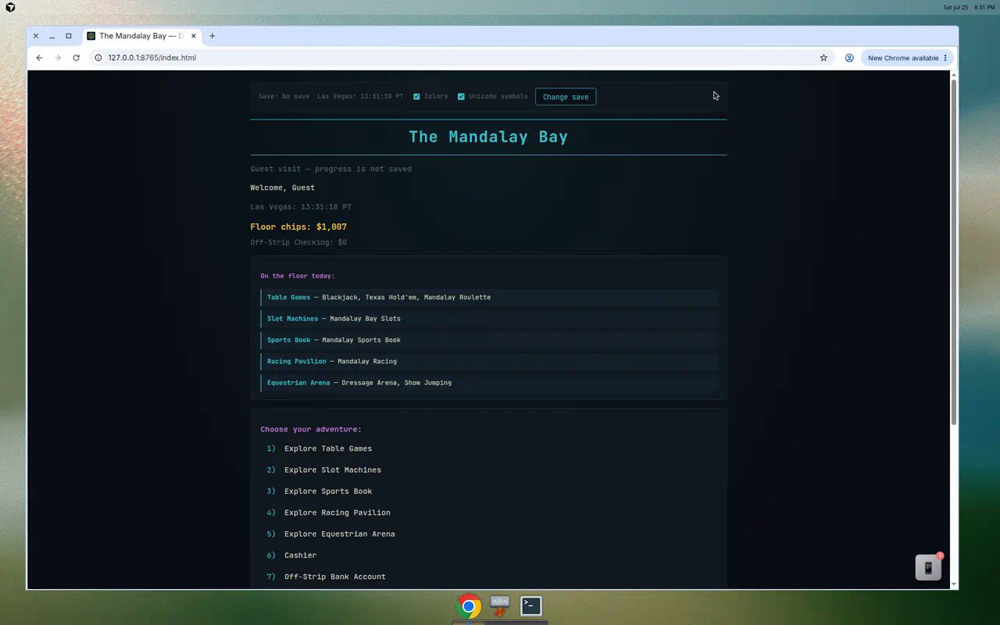

# The Mandalay Bay Wiki

Welcome to the official wiki for **[degen-llms](https://github.com/Exios66/degen-llms)** — a satirical choose-your-adventure resort simulator with a unified chip economy.

*Web terminal main lobby — chip wallet, floor navigation, and resort amenities.*

## Play now

| Surface | Link |
|---------|------|
| **Web terminal** | https://exios66.github.io/degen-llms/ |
| **Pixel RPG** | https://exios66.github.io/degen-llms/rpg/ |
| **CLI** | `python3 -m mandalay_bay` |
| **Quarto docs (Posit Connect Cloud)** | https://019f9a67-d5c9-226b-b6b1-a86d1655be69.share.connect.posit.cloud/ |

See [[Access-Points]] for full details on every surface.

📸 **More screenshots:** [[Screenshots-Gallery]]

---

## About the resort

- [[About-The-Mandalay-Bay]] — Vision, tone, and what makes this project unique
- [[Casino-Offerings]] — Every floor, activity, and amenity on property
- [[MGM-Rewards]] — Tier progression, comps, and perks
- [[Resort-Hotel]] — Check-in, rooms, amenities, and day/night cycle
- [[Resort-Dining]] — Aureole, Border Grill, Stripsteak capacity overlay
- [[Pool-Complex]] — 11-acre pool expansion, Shark Reef, beach club

---

## Player guides

- [[Getting-Started]] — Install, launch, first visit
- [[Player-Guide]] — Every menu, dialog, and navigation flow
- [[Chip-Economy]] — Wallet, ledger, buy-ins, cash-outs
- [[Save-Slots]] — Save library, CLI flags, RPG state

### Games & activities

- [[Blackjack]]
- [[Table-Games]] — Texas Hold'em, roulette, craps
- [[Slot-Machines]]
- [[Lottery-Counter]]
- [[Sports-Book-and-Prediction-Markets]]
- [[Trading-Floor]]
- [[Arcade-Alley]]
- [[Racing-and-Equestrian]]

---

## Pixel RPG simulator

Walk the resort in a **Pokémon-style pixel overworld** built with Phaser 3.

- [[Pixel-RPG-Simulator]] — Maps, controls, encounters, quests, saves, and expansion roadmap

---

## Developer documentation

- [[Architecture]] — Packages, data flow, activity system
- [[Developer-Guide]] — Adding activities, testing, deployment
- [[RNG-and-Fairness]] — CSPRNG guarantees

---

## Repository

- **Source:** https://github.com/Exios66/degen-llms
- **License:** MIT
- **Tests:** 200+ pytest cases

Python is the authoritative game logic; the browser terminal and pixel RPG mirror it in vanilla ES modules.
