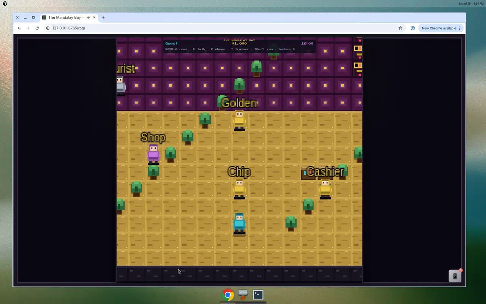

# Pixel RPG Simulator

Walk **The Mandalay Bay** in a **16-bit JRPG–style overworld** built with Phaser 3. Inspired by [Operation Epic Furious](https://www.epicfurious.com/).



**Play URL:** https://exios66.github.io/degen-llms/rpg/

---

## Vision

Transform the menu-driven terminal casino into an explorable resort:

- Top-down overworld navigation
- NPC dialogue trees with branching choices
- Casino activities as **encounters** (DOM overlays, not scene redirects)
- Unified chip economy and save library shared with CLI and web terminal
- Dense environmental storytelling, Easter eggs, and Mandalay Bay–themed zones

**Core loop:** walk → talk → play → earn chips → save position.

---

## Access

| Method | URL |
|--------|-----|
| Direct | https://exios66.github.io/degen-llms/rpg/ |
| From terminal | Link in web hub menu |

Saves use the same `localStorage` key (`mandalay-bay-library`) as the web terminal. RPG adds an `rpg` object to each save slot.

---

## Your guest

The title screen's character creator picks an archetype and then the sprite you
actually walk around as — skin tone, hair color, and outfit, with a live
preview. The Trainer Card's wardrobe reopens the same creator mid-game.

| Archetype | Flavor | Perk |
|-----------|--------|------|
| `weekend_warrior` | Default tourist | +10% first slot spin payout |
| `high_roller` | Whale energy | High Limit access at 5,000 chips |
| `convention_goer` | Badge and lanyard | 10% cashier buy-in bonus |
| `local` | Knows the shortcuts | Back-hall shortcut unlocked |

---

## Controls

| Input | Action |
|-------|--------|
| Arrow keys / WASD | Move |
| Tap / click a tile | Walk there — the resort is playable on a phone |
| Shift | Run |
| E / Enter / Space | Talk / advance dialogue |
| Mouse | Dialogue choices, game buttons |
| **T** | Trainer Card (quests, reputation, wardrobe) |
| **P** | MGM Rewards phone |

Gold walkways connect every door, dark trim borders each zone, and floating
signs name the room you're in — follow the gold and you can't get lost.

---

## The property

Twenty-eight rooms across eight wings, authored as declarative JSON in
`docs/rpg/js/data/maps/` and compiled into tile layers at boot by `MapLoader`.
Each room has its own spawn point, and doors sit on the outer walkable ring so
the warp fires as you step onto one.

| Wing | Rooms |
|------|-------|
| Arrival | Las Vegas Blvd, Valet & Parking, Registration Lobby |
| Casino | Casino Floor North, Casino Floor South, Race & Sports Book, High Limit Salon, Foundation Room |
| Retail | The Shoppes at Mandalay Place, Sky Bridge, Convention Center |
| Bars | Betty's Bar, Skyfall Lounge |
| Hotel | Tower Elevator Lobby, Guest Floor Corridor, Your Room, Delano Wing, Bathhouse Spa |
| Pool | Mandalay Beach, Cabanas & Hot Tubs, Moorea Beach Club, Moonlight Rave Stage |
| Attractions | Shark Reef Tunnel, Shark Reef Exhibit Hall, House of Blues, HOB Green Room, ULTRA Arena Concourse |
| Back of house | Back of House |

Three doors are gated: the High Limit Salon checks chips and stake tier through
`docs/js/venues.js`, the Foundation Room wants Noir standing, and your own room
door stops working while the folio is unpaid.

---

## Activity encounters

**The RPG does not reimplement game screens.** Hotel, pool, shops, bars, slots,
sportsbook, prediction markets, craps, the lottery counter, racing, equestrian,
cashier, bank, and every meta screen are written once in `docs/js/ui/` as
`buildXRenderers(ctx)` factories. The web terminal spreads those factories into
its renderer table; the RPG's `TerminalHostOverlay` builds the same context and
mounts the identical functions inside an encounter panel. A feature shipped to
the terminal appears in the RPG with no RPG-side work.

The four exceptions are the bespoke pixel "battle screens" that read better
in-world — blackjack, hold'em, roulette, and the House of Blues rhythm
minigame. They still take their bet limits from the shared stake-tier picker.

| Encounter | Where it lives | Reached from |
|-----------|----------------|--------------|
| `blackjack`, `holdem`, `roulette` | Bespoke pixel overlays | Casino floor pits |
| `rhythm` | Bespoke pixel overlay | House of Blues stage |
| `craps`, `lottery` | Hosted from `docs/js/ui/` | Stickman Stan's rail, Lottery Lena's counter |
| `slots`, `sportsbook`, `predictions` | Hosted | Slot aisle, Bookie Blake's board |
| `horse_racing`, `dressage`, `jumper`, `horse_stables` | Hosted | Racing pavilion |
| `hotel*`, `pool*`, `shops`, `bar` | Hosted | Tower, pool deck, the Shoppes |
| `cashier`, `bank`, `stats`, `staff_manifest` | Hosted | Cage, back of house, START menu |

### Encounter flow

```
OverworldScene._tryInteract()
  → DialogueManager.start(dialogueId)
  → choice with "encounter": "craps"
  → EncounterBridge.start("craps")
  → TerminalHostOverlay mounts the shared renderer  [DOM]
  → session.wallet updated by the shared logic
  → SaveAdapter.persist()
  → OverworldScene resumes
```

---

## Pokémon-style systems

| System | Detail |
|--------|--------|
| **START menu** | Esc or X — Trainer Card, Quests, Dex, Bag, Secrets, Phone, Bank, Stats, Staff, Guest Book, Completion, Options, Save |
| **Challengers** | NPCs with a `sight` cone spot you, walk over, and open with their encounter — once each |
| **Quests** | Ten in `js/data/quests.json`, progress derived from shared session state so it can never disagree |
| **Dex** | Shark Reef species, slot machines played, staff met |
| **Bag** | Quest items, mall purchases, minibar tabs |
| **Secrets** | Twelve easter eggs, cosmetic only — an egg never pays chips |
| **Schedules** | NPCs move between positions as the world clock turns |

---

## Architecture

### Hybrid Phaser + DOM

- **Phaser** renders the overworld (tiles, sprites, camera, day/night wash)
- **DOM overlays** carry dialogue and every game screen, which is what lets the
  RPG mount the terminal's own renderers rather than redrawing them in Phaser

### File layout

```
docs/rpg/
├── index.html               # RPG entry point
├── css/rpg.css              # Pixel skin, including for mounted terminal screens
├── GDD.md                   # Full design document
└── js/
    ├── main.js              # Bootstrap: title → Phaser → overlays
    ├── data/                # The world as data
    │   ├── maps/*.json      # 28 room records + index.json
    │   ├── npcs.json        # Rosters, sight cones, schedules
    │   ├── dialogues.json   # 255 dialogue nodes
    │   ├── quests.json      # Quest board
    │   ├── easter_eggs.json # Secrets registry
    │   └── triggers.json    # Zone messages and warps
    ├── scenes/
    │   ├── GameScenes.js    # OverworldScene (Phaser)
    │   └── TitleScreen.js   # DOM save picker + HUD
    └── systems/
        ├── MapTiles.js      # Tile vocabulary
        ├── MapLoader.js     # JSON → tile layers
        ├── MapData.js       # Accessors + procedural fallback
        ├── TextureFactory.js
        ├── DialogueManager.js
        ├── SaveAdapter.js
        ├── EncounterBridge.js / HostedEncounters.js
        ├── TerminalHostOverlay.js   # Mounts docs/js/ui/ screens
        ├── MenuOverlay.js           # START menu
        ├── QuestManager.js / Dex.js / Inventory.js / EasterEggs.js
        └── overlays/                # Bespoke battle screens only
            ├── HoldemOverlay.js
            ├── RouletteOverlay.js
            └── RhythmOverlay.js
```

Shared game logic and screens live in `docs/js/`.

---

## NPC roster

Sixty-one NPCs live in `js/data/npcs.json`, keyed by map id. Twelve of them have
a `sight` cone and challenge you on sight; nine move between positions as the
resort clock turns.

| Wing | Room | Who you'll meet |
|------|------|-----------------|
| Arrival | Las Vegas Blvd | Doorman Dante, Cab Line Carl |
| Arrival | Valet & Parking | Valet Vic |
| Arrival | Registration Lobby | Chip Chandler, Golden Statue, Tourist Tina, Bell Desk Bruno |
| Casino | Casino Floor North | Blackjack Pit, Hold'em Pit, Roulette Pit, Stickman Stan, Spinster Sal, Cashier Carmen, Security Sam, High Limit Host, Shop Clerk |
| Casino | Casino Floor South | Pavilion Paula, Arena Alex, Slot Tech Tessa, Cocktail Cora |
| Casino | Race & Sports Book | Bookie Blake, Stable Hand Stu |
| Casino | High Limit Salon | Salon Pit Boss, Salon Dealer, Salon Cage |
| Casino | Foundation Room | Whale Whitney, Whale Warren, Host Alexandra |
| Retail | The Shoppes at Mandalay Place | Boutique Bianca, Bag Check Bev, Lottery Lena |
| Retail | Sky Bridge | Busker Bo |
| Retail | Convention Center | Badge Barry, Vendor Val |
| Bars | Betty's Bar | Barkeep Betty, Regular Reggie |
| Bars | Skyfall Lounge | Sommelier Sy |
| Hotel | Tower Elevator Lobby | Clerk Carmen, Concierge Cleo |
| Hotel | Guest Floor Corridor | Housekeeper Hana, Room 24-118 |
| Hotel | Your Room | Room Console, Minibar |
| Hotel | Delano Wing | Delano Dana |
| Hotel | Bathhouse Spa | Attendant Ash |
| Pool | Mandalay Beach | Lifeguard Lou, Reef Guide |
| Pool | Cabanas & Hot Tubs | Cabana Curtis, Hot Tub Hal |
| Pool | Moorea Beach Club | Beach DJ |
| Pool | Moonlight Rave Stage | Moonlight DJ |
| Attractions | Shark Reef Tunnel | Photo Kiosk |
| Attractions | Shark Reef Exhibit Hall | Reef Docent, Reef DJ |
| Attractions | House of Blues | Stage Manager, HOB Bouncer |
| Attractions | HOB Green Room | The Headliner |
| Attractions | ULTRA Arena Concourse | Arena Usher, Merch Marge |
| Back of house | Back of House | Janitor Joe, Count Room Cal |

Not every NPC is a person: room consoles, the minibar, the lobby statue, and the
photo kiosk are interactables wearing the same record shape, which is how a
`dialogueId` can lead straight into a terminal screen.

The seven blackjack, hold'em, and roulette dealers you actually sit down with
rotate through `docs/js/dealers.js` (a mirror of `mandalay_bay/dealers.py`), so
the pit NPCs above are doors into that roster rather than fixed characters —
meeting them fills the staff page of the Dex.

---

## Dialogue system

Dialogue trees live in `js/data/dialogues.json`.

### Node schema

```json
{
  "node_id": {
    "speaker": "NPC Name",
    "text": "Line of dialogue.",
    "next": "optional_next_node_id",
    "setFlag": "optional_flag_to_set",
    "encounter": "optional_encounter_id",
    "choices": [
      {
        "label": "Player choice text",
        "next": "node_id",
        "encounter": "blackjack",
        "setFlag": "flag",
        "requiresFlag": "only_if_set",
        "unlessFlag": "hide_if_set"
      }
    ]
  }
}
```

### Authoring workflow

1. Add nodes to `dialogues.json`
2. Reference by `dialogueId` on NPC in `MapData.js`
3. Use flags for return visits: `requiresFlag`, `unlessFlag`, `setFlag`

---

## Quest system

Quests live in `js/data/quests.json` and are tracked in `rpg.quests`:

```json
{
  "shark_photos": { "stage": 2, "target": 5 },
  "dana_lucky_hand": { "stage": "complete" }
}
```

Progress is *derived*, not incremented. `QuestManager.syncDerived()` reads reef
photos, bar orders, dex counts, purchases, unlocked vignettes, egg count, and
resort completion from shared session state, so a quest can never disagree with
the system that produced it — and work done before you accept a quest is banked
and applied the moment you take the job.

The **Trainer Card** (press **T**) shows quests, faction reputation, play time,
and the resort clock; the START menu's quest page also lists the jobs you have
*not* accepted, with the name of whoever hands each one out.

---

## The resort clock

`docs/js/world-cycle.js` is the single clock for all three surfaces: two real
hours make one resort day, split into four phases. In the overworld that clock
washes the screen per phase, walks NPCs to their scheduled positions, announces
the day's rotating reservation requirement, posts daily resort charges to your
wallet, and evicts you from your room if the folio goes unpaid. `rpg.worldTime`
is still written so older readers keep working.

---

## Save schema (RPG fields)

`SAVE_VERSION` is **8**.

```json
{
  "version": 8,
  "playerName": "Guest",
  "wallet": { "balance": 1000, "transactions": [] },
  "rpg": {
    "mapId": "strip_sidewalk",
    "x": 15,
    "y": 26,
    "archetype": "weekend_warrior",
    "playerSprite": "weekend_warrior",
    "flags": { "tutorial_complete": true },
    "quests": {},
    "inventory": [],
    "dex": { "reef": [], "slots": [], "staff": [] },
    "eggs": {},
    "mapVisits": {},
    "options": { "muted": false, "textSpeed": "normal", "footsteps": true },
    "reputation": { "whales": 0, "staff": 0, "tourists": 0 },
    "worldTime": 720
  }
}
```

A v7 save migrates forward without a key rename and keeps the map it was saved
on. On the Python side, `mandalay_bay/saves.py` carries the web-only keys
through a CLI load/save round trip untouched, so playing in the terminal never
erases pixel progress.

**Rules for save changes:**

1. Bump `SAVE_VERSION` in `docs/js/core.js`
2. Migrate in `PlayerSession.fromJSON()` — never break older saves
3. Document new fields here and in [[Save-Slots]]

---

## Audio & polish

| Feature | Detail |
|---------|--------|
| **BGM** | Zone-specific tracks via Web Audio (lobby, casino floor, encounters) |
| **SFX** | Footsteps by tile type, blackjack natural 21 shake, slot reel stops |
| **Cabinet bezel** | CSS arcade frame around `#game-shell` |
| **Konami code** | Secret room Easter egg |
| **Procedural textures** | `TextureFactory.js` generates pixel art at runtime |

### Art pipeline (future)

Layouts are already data (`js/data/maps/*.json`); the art is not. The remaining
step is swapping `TextureFactory`'s runtime-generated tiles for an Aseprite
tileset, which `MapLoader` can consume without changing a single map record.

---

## Developer notes

To add to the RPG:

| To add… | Do this |
|---------|---------|
| A room | Add a record to `scripts/_author_maps.py`, regenerate, wire doors both ways |
| An NPC | Add to the `NPCS` table plus a `*_greet` node in `dialogues.json` |
| A quest | Add to `quests.json` and derive its progress in `QuestManager.syncDerived()` |
| An easter egg | Add to `easter_eggs.json` and set its flag from a dialogue choice or zone trigger — cosmetic only |
| A casino screen | Build it in `docs/js/ui/` as `buildXRenderers(ctx)`, route it from `HostedEncounters.js`, and give an NPC a line that opens it. Never write it twice |

Then run the checks:

```bash
node scripts/smoke-test-rpg.mjs     # world-data referential integrity
python3 scripts/smoke-test-web.py   # browser walk + end-to-end journey
python3 -m pytest                   # Python rules
```

See [[Developer-Guide]] and the full GDD at `docs/rpg/GDD.md` in the repository.
