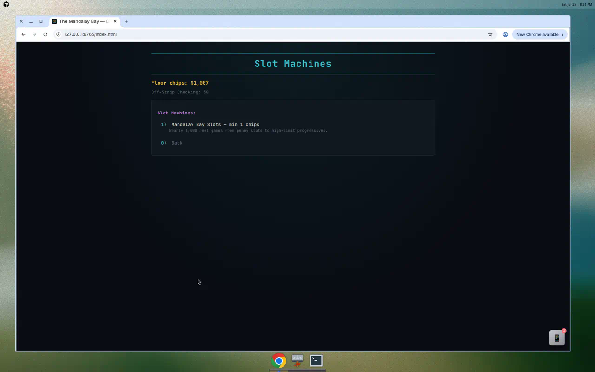

# Slot Machines

Three-reel and video slot machines on the **Slot Machines** floor — modeled after games found at MGM Mandalay Bay, from penny slots to linked progressives.



## Stake tiers

Choose a tier before playing any machine:

| Tier | Range | Notes |
|------|-------|-------|
| Penny & Low Limit | $1 – $25 | Micro stakes |
| Standard | $5 – $100 | Main floor |
| High Limit | $25 – $500 | High-limit room |
| **401K Contribution** | **$542 – $6,500** | Avg. U.S. employee deferral |
| **High Roller / No Limit** | **$2,500 – bankroll** | No table maximum |

Salon tiers apply across **every** machine and table. Progressive jackpots still require the **effective max bet** for your tier to qualify.

## Machines

| Machine | Min bet | Max bet | Type |
|---------|---------|---------|------|
| Mandalay Fortune | $5 | $50 | Classic |
| High Roller | $25 | $500 | High limit |
| **Megabucks** | $1 | $3 | Wide-area progressive |
| Wheel of Fortune | $1 | $25 | Video slot |
| Blazin' 7s | $1 | $25 | Classic progressive |
| Buffalo Gold | $1 | $50 | Video slot |
| Monte Carlo | $1 | $5 | Linked progressive |
| Super Spin | $1 | $5 | Linked progressive |
| Triple Red Hot 7s | $1 | $25 | Classic |
| Double Jackpot | $1 | $25 | Video slot |
| Spooky Link | $1 | $25 | Themed video |
| Wizard of Oz | $1 | $25 | Themed video |
| Emerald Guardian | $1 | $25 | Themed video |
| Tiger and Dragon | $1 | $50 | Themed video |

Max bet is capped by your current chip balance. Progressive machines display the current jackpot in the machine picker.

## Game flow

```
Slot Machines → Mandalay Bay Slots → Choose stake tier → Pick machine → Spin loop → Leave
```

1. Choose a stake tier
2. Select a machine — paytable and jackpot displayed
3. Enter spin amount (or `0` to leave)
4. Reels spin with secure weighted RNG
5. Payout applied immediately
6. Spin again or leave

### Last bet persistence

Your **last spin amount** stays selected as the default for the next pull. The bet input does not reset to minimum after each spin (web and CLI).

## Progressive jackpots

| Pool | Machines | Seed | Qualification |
|------|----------|------|---------------|
| Megabucks | Megabucks | 250,000 chips | Three 💵 at max bet ($3) |
| Mandalay linked | Monte Carlo, Super Spin | 50,000 chips | Three 👑 or ⭐ at max bet ($5) |

Each qualifying spin contributes a small percentage of the bet to the pool. Jackpots persist in your save slot.

## Mandalay Fortune paytable

| Result | Multiplier |
|--------|------------|
| 7 — 7 — 7 | 100x |
| 💎 — 💎 — 💎 | 50x |
| 🔔 — 🔔 — 🔔 | 25x |
| BAR — BAR — BAR | 15x |
| 🍒 — 🍒 — 🍒 | 10x |
| 🍒 — 🍒 (first two) | 2x |
| 🍒 (first reel only) | 1x (bet returned) |

Each machine has its own symbols, weights, and paytable.

## RNG

Each reel independently selects a symbol via `secrets.SystemRandom()` (CLI) or `crypto.getRandomValues()` (browser) from the weighted pool.

## Pixel RPG

Talk to **Spinster Sal** in the slot aisle. Multiple machine encounters available as DOM overlays.

## Implementation

| Path | Role |
|------|------|
| `mandalay_bay/activities/slots.py` | Machine catalog, progressives |
| `docs/js/slots.js` / `docs/js/slots-ui.js` | Browser mirror |
| `docs/js/ui/slots-renderers.js` | Category menu, machine picker, and spin loop the RPG mounts too |
