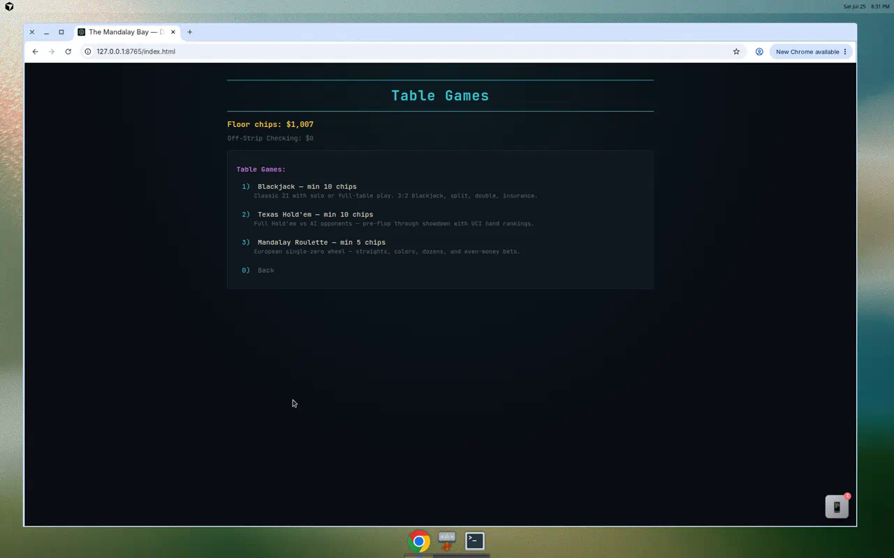

# Table Games

Table Games floor activities: **Texas Hold'em**, **Mandalay Roulette**, and **Craps** (plus [[Blackjack]]).



Minimum bet: **10 chips** (varies by stake tier).

---

## Texas Hold'em

No-limit Texas Hold'em at a **5-player table** — you plus four bots.

### Game flow

```
Preflop → Flop → Turn → River → Showdown
```

Each street has a full betting round. Players can check, call, raise (custom amount), fold, or go all-in.

### Key features

| Feature | Detail |
|---------|--------|
| Players | 5 total (1 human, 4 bots) |
| Betting | No-limit — raise any amount up to stack |
| Buy-in | Persists across hands; stack accrues wins/losses |
| Bot AI | Raises, calls, folds based on hand strength |
| Street display | Visual timeline shows current street |
| Action log | Full history of bets and bot actions |

### Controls (web / RPG)

- **Fold / Check / Call** — standard actions
- **Raise** — enter custom amount or use min-raise
- **All-in** — bet entire stack
- **Leave table** — remaining stack credited to wallet

### Implementation

| Path | Role |
|------|------|
| `poker/holdem.py` | Python table engine |
| `poker/hand_eval.py` | Hand ranking |
| `docs/js/holdem/game.js` | Browser mirror |
| `mandalay_bay/activities/holdem.py` | CLI activity |

---

## Roulette

American roulette wheel with **0** and **00**.

### Bet types

| Category | Examples |
|----------|----------|
| Inside | Straight, split, street, corner, six-line |
| Outside | Red/black, odd/even, high/low, dozens, columns |

### Features

- **Spin history** — animated, dynamically updating result strip (web)
- **Last wager remembered** — default bet input retains previous amount
- Standard American payouts

### Implementation

| Path | Role |
|------|------|
| `mandalay_bay/activities/roulette.py` | CLI activity |
| `docs/js/roulette.js` | Browser engine + history |
| `docs/rpg/js/systems/overlays/RouletteOverlay.js` | RPG overlay |

---

## Craps

Classic dice table with Pass Line, Don't Pass, and side bets.

### Phases

| Phase | Description |
|-------|-------------|
| **Come-out** | No point set — 7/11 wins Pass Line; 2/3/12 loses |
| **Point** | Point number established — roll point before 7 to win |

### Bets

| Bet | Description |
|-----|-------------|
| **Pass Line** | Bet with the shooter |
| **Don't Pass** | Bet against the shooter |
| **Field** | One-roll bet on 2, 3, 4, 9, 10, 11, or 12 |
| **Any Craps** | Wins on 2, 3, or 12 |
| **Hard Ways** | 4, 6, 8, or 10 as doubles before easy or seven-out |
| **Yo-11** | One-roll bet on 11 |

### Features

- Animated dice display (web)
- Point marker on table
- Roll history
- Dealer quips from Dice Delgado

### Implementation

| Path | Role |
|------|------|
| `mandalay_bay/craps.py` | Python engine |
| `docs/js/craps.js` | Browser mirror |
| `mandalay_bay/activities/craps.py` | CLI activity |
| `docs/js/ui/craps-renderers.js` | Table screen the RPG mounts too |

---

## Stake tiers

All table games respect the selected stake tier. See [[Casino-Offerings#stake-tiers]].

## Pixel RPG

Roulette and hold'em launch from their pit NPCs on the casino carpet, and
**Stickman Stan** runs the craps rail on the north floor — he'll call you over
if you walk through his sightline twice. See [[Pixel-RPG-Simulator]].
